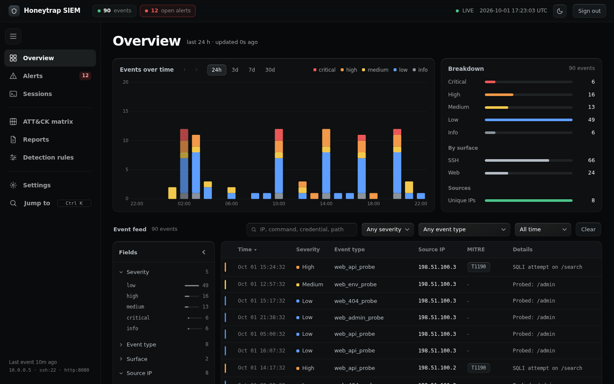

# Honeytrap SIEM

A medium-interaction honeypot pair (SSH + web) feeding a custom, self-hosted SIEM.
Attacker activity is pulled from the honeypot VM, scored, mapped to MITRE ATT&CK,
correlated into alerts by a detection engine, and investigated through a clean,
dark "slate" console with case management and deterministic incident reports.

Built as an academic cybersecurity project at IIITDM Kancheepuram.



## Features

**Sensors (honeypot VM)**
- `ssh_honeypot.py`: Paramiko fake shell with a scripted filesystem. Detects brute force,
  recon, credential theft, privilege escalation, SSH key persistence, memory exploit attempts
  (shellcode, NOP sleds, format strings, oversized input) and supply-chain techniques
  (malicious installs, rogue repositories, CI/CD secret access). Nothing is ever executed.
- `web_honeypot.py`: decoy corporate portal with payload inspection for SQLi, XSS, command
  injection, path traversal and LFI, scanner fingerprinting, honeytoken files and fake
  package registry endpoints (`/simple/`, `/npm/`, `/v2/`).

**SIEM (analyst PC)**
- Live overview: events over time stacked by severity, severity and surface breakdown,
  filterable event feed with a Splunk-style Fields panel and an event detail drawer.
- Sessions: SSH sessions and web sources with full timelines and case management.
- Alerts: correlated detections kept separate from events (kill-chain completion,
  cross-surface correlation, plus your own rules).
- Detection rules: threshold rules built as a sentence, stored as structured data and never
  executed as code (field and group names come from a fixed allow-list).
- ATT&CK matrix heatmap with per-technique drill-down.
- Deterministic incident reports (no AI), printable.
- Slate UI: glass panels, collapsible rail, light "paper" theme with a circular reveal,
  Ctrl K command palette, GSAP entrance motion, cross-page view transitions,
  and full `prefers-reduced-motion` support.

## Architecture

```
 attacker ──► honeypot VM ─────────────────────────────┐
              ssh_honeypot.py  (port 22)               │ logs/ssh.json
              web_honeypot.py  (port 8080)             │ logs/web.json
                                                       ▼
 analyst PC   pipeline.py  ── SFTP pull every 5 s ──► siem.db (SQLite)
                 │  severity scoring, MITRE mapping,       ▲
                 │  detection engine (alerts)              │
                 └─────────────────────────────────────────┘
              app.py (Flask) ──► browser console on http://127.0.0.1:5000
```

## Repository layout

```
honeytrap-siem/
├── .env.example          configuration template (copy to .env)
├── run_siem.sh / .bat    start pipeline + dashboard together
├── honeypot/             runs on the honeypot VM
│   ├── ssh_honeypot.py
│   ├── web_honeypot.py
│   └── requirements.txt
├── siem/                 runs on the analyst PC
│   ├── app.py            Flask app + JSON APIs
│   ├── pipeline.py       SFTP puller, enrichment, detection engine
│   ├── config.py         reads .env
│   ├── templates/        Jinja pages (base.html holds the shared shell)
│   ├── static/           slate.css, slate.js, gsap.min.js
│   └── requirements.txt
└── docs/screenshots/
```

## Setup

You need Python 3.10 or newer on both machines.

### 1. Configure

```bash
cp .env.example .env        # Windows: copy .env.example .env
```

Edit `.env` and replace every `<PLACEHOLDER>`:

| Setting | Meaning |
|---|---|
| `SIEM_ADMIN_USER`, `SIEM_ADMIN_PASSWORD` | Dashboard login |
| `SIEM_SECRET_KEY` | Random string for Flask sessions |
| `HONEYPOT_HOST` | IP of the honeypot VM, for example `<HONEYPOT_VM_IP>` |
| `HONEYPOT_SFTP_PORT` | The VM's real SSH port (default 2222, since 22 belongs to the honeypot) |
| `HONEYPOT_SFTP_USER`, `HONEYPOT_SFTP_PASSWORD` | VM account used to pull logs |
| `HONEYPOT_LOG_DIR` | Folder on the VM holding `ssh.json` and `web.json`, e.g. `<dir>/honeypot/logs` |

The app refuses every login while the password is still a placeholder.

### 2. Honeypot VM

Copy the sensors to the VM:

```bash
scp -P <VM_SSH_PORT> honeypot/*.py honeypot/requirements.txt <HONEYPOT_VM_USER>@<HONEYPOT_VM_IP>:<dir>/honeypot/
```

On the VM:

```bash
cd <dir>/honeypot
python3 -m venv venv && source venv/bin/activate
pip install -r requirements.txt
sudo venv/bin/python ssh_honeypot.py     # port 22 needs root (or use authbind / setcap)
python web_honeypot.py                   # second terminal, port 8080
```

Both write JSON lines into `<dir>/honeypot/logs/`.

### 3. Analyst PC

```bash
python -m venv venv
source venv/bin/activate              # Windows: venv\Scripts\activate
pip install -r siem/requirements.txt
./run_siem.sh                         # Windows: run_siem.bat
```

Or run the two processes yourself from `siem/`: `python pipeline.py` and `python app.py`.
Open http://127.0.0.1:5000 and sign in. Run `pipeline.py` at least once before creating
detection rules, since it creates the `detections` and `rules` tables.

## Using the console

- **Overview**: click a bar in the chart to filter the feed to that window. Click a value in
  Fields to filter; filters stack and show as removable chips. Click a row for full detail.
- **Ctrl K** jumps to any page or action. The rail collapses with the menu button.
- **Settings** picks the theme, the theme switch animation and the page title animation.
- **Sessions → Generate report** writes an incident report you can print from Reports.

## Security notes

- `.env`, the SQLite database, synced logs and the honeypot host key are git-ignored. Keep it that way.
- All attacker-controlled strings are HTML-escaped before rendering, and no page puts data inside
  inline event handlers (data attributes plus delegated listeners only).
- The credentials and keys inside `ssh_honeypot.py` and `web_honeypot.py` (fake `.env`,
  `/etc/shadow`, AWS keys, `.pypirc`, and so on) are **intentional decoys**. They are fabricated
  bait, the AWS pair is AWS's own published documentation example, and none of them grant access
  to anything. `.github/secret_scanning.yml` excludes the `honeypot/` folder from GitHub secret
  scanning so these decoys do not raise false alerts; the rest of the repo is still scanned.
- Run the honeypot only on an isolated lab network you control.

## Credits

- Motion: [GSAP](https://gsap.com) (bundled `gsap.min.js`, standard GreenSock license).
- Fonts: Inter and JetBrains Mono via Google Fonts, with system fallbacks offline.
- MITRE ATT&CK® is a registered trademark of The MITRE Corporation.
